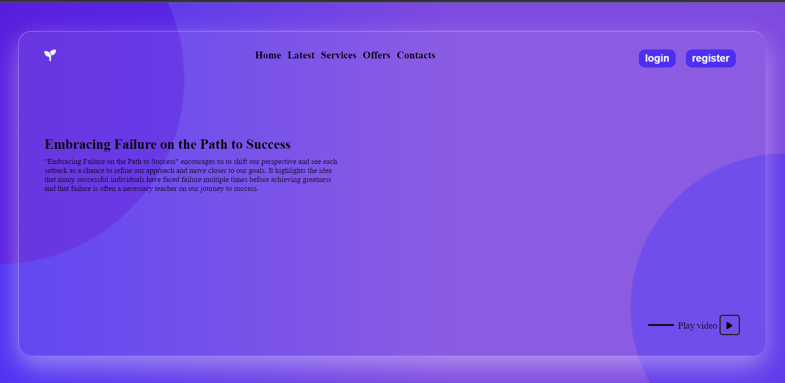

# Glassmorphism
Glassmorphism is a design trend in user interface (UI) and web design that uses frosted glass-like elements with a blurred background to create a visually appealing and translucent effect. So I tried that for the first time while upgrading my CSS skills

